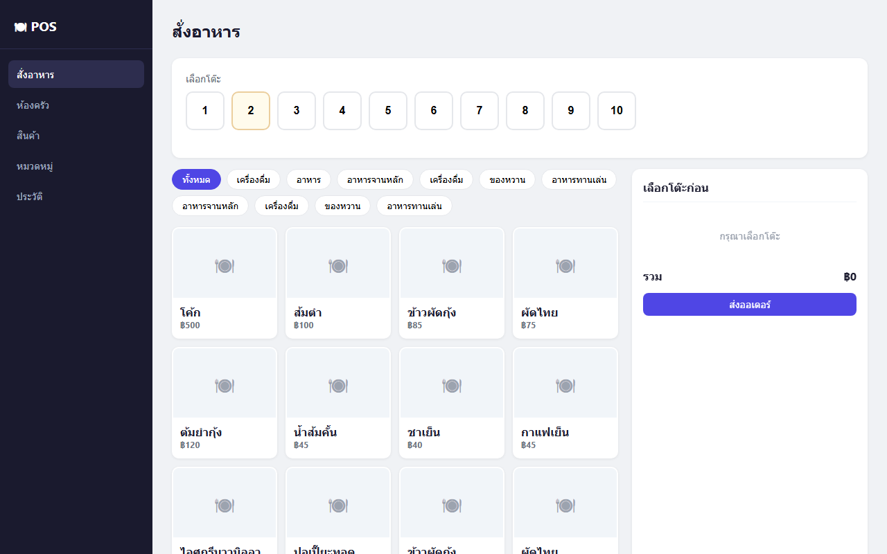
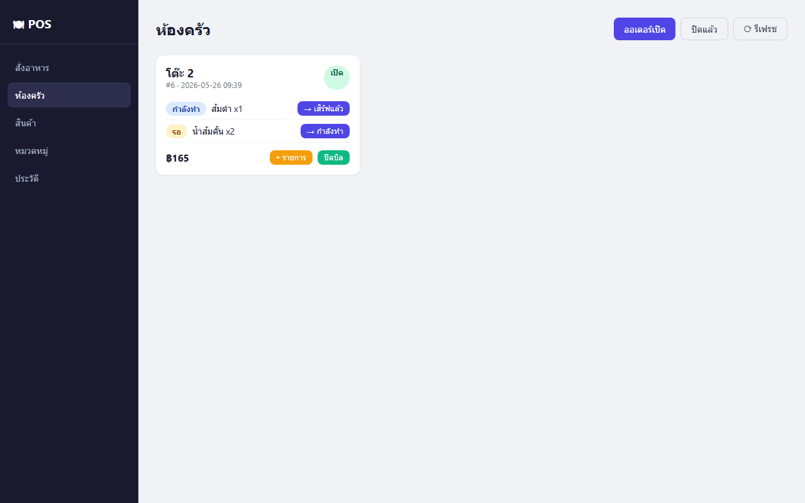
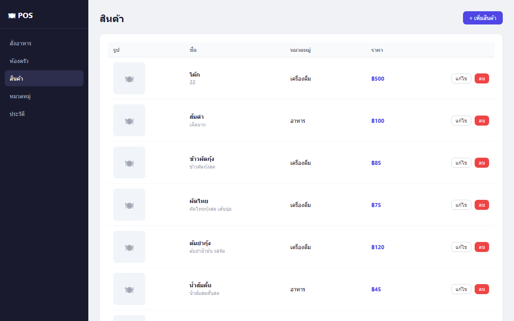
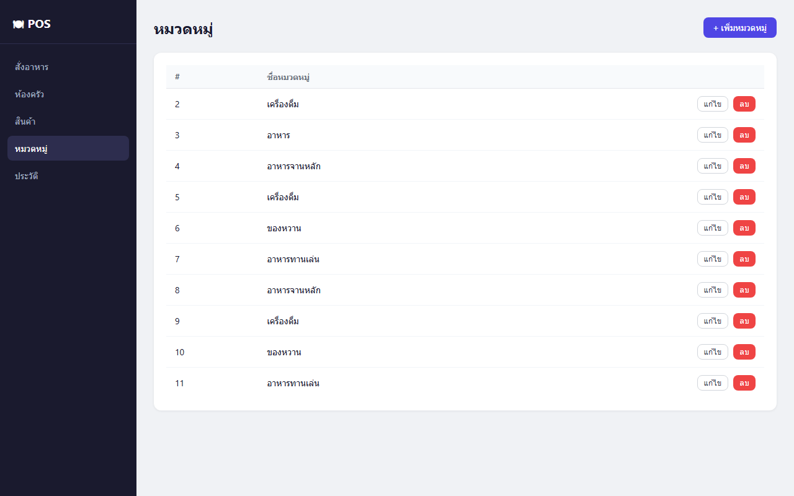
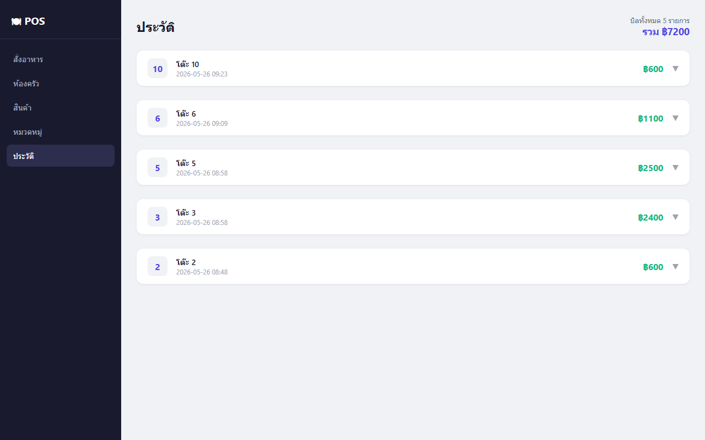

# POS System

ระบบ Point of Sale สำหรับร้านอาหาร พัฒนาด้วย Node.js + Express + SQLite + React + Vite

---

## Tech Stack

| Layer    | Technology                     |
|----------|-------------------------------|
| Backend  | Node.js, Express.js            |
| Database | SQLite (better-sqlite3)        |
| Frontend | React 18, Vite, React Router   |
| Images   | Stored as BLOB in SQLite       |

### สั่งอาหาร

### ห้องครัว

### สินค้า

### หมวดหมู่

### ประวัติ

